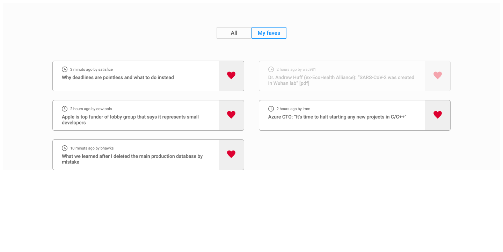

# Reign technical test

## Description

This is a web application that makes a list of posts about frameworks, it includes a dropdown by frameworks name and when you click on one shows the filtered list, you have the option to add to favorites and view the original post in a tab, the filter and the list of favorites are stored in the localStorage to have data persistence.

## Setup and Running

### Pre-requisites

You have to download [Nodejs](https://nodejs.org/es/) version 16.17.0 in the computer.

### Installation

After to clone the repository from `main` branch next open a console on the folder and move to the `reign-technical-test` folder

```bash
# move to the app project
cd reign-technical-test
```
Next open project directory, you can run:
```bash
# npm install

```

## App images
<table>
  <tr>
    <th>Post List</th>
    <th>List favorites</th>
  </tr>
	<tr>
    <td></td>
    <td></td>        
	</tr>
</table>

## Builded with
//This project was bootstrapped with [Create React App](https://github.com/facebook/create-react-app).
- [Create React App](https://github.com/facebook/create-react-app). - React.
- [Nodejs](https://nodejs.org/es/) - Nodejs.